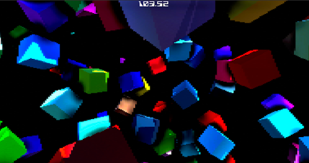

# CubeStorm

A first-person reflex arcade game where you attempt to weave through an infinite storm of cubes. How long can you survive the storm?

One of my first games ever made in Unity.

## Play Now

Download the application for free on Windows, Mac and Linux from: https://dispixel.itch.io/cubestorm

  
  
  
  
  

## Features

## Infinite Challenge

Test your reflexes and endurance as you fly through an infinite space of pixelated and colorful cubes. How long can you survive in the storm?

## Dependencies

This project uses the following free assets:

- [Joystick Pack](https://assetstore.unity.com/packages/tools/input-management/joystick-pack-107631)
